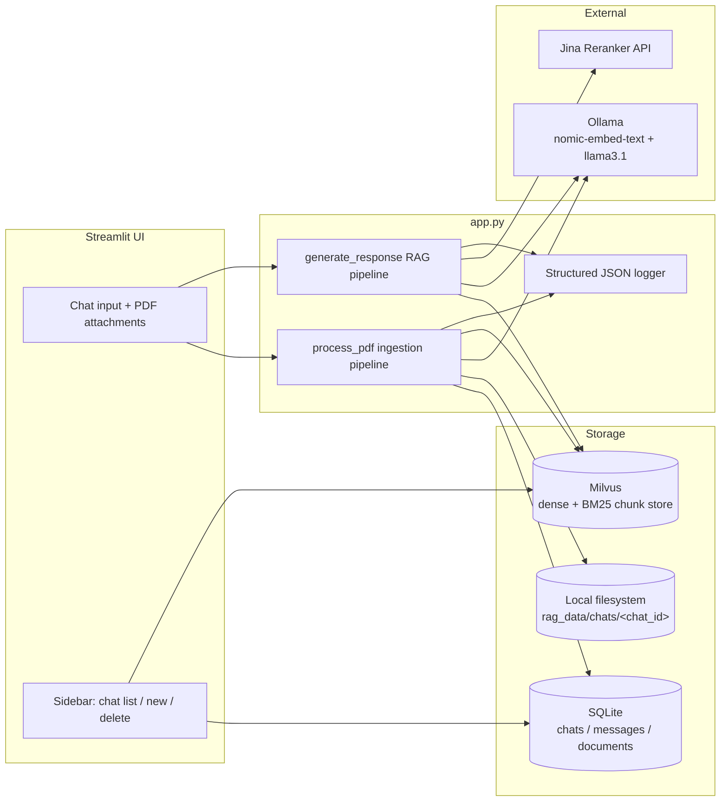

# PDF RAG Chat : Design Document

## 1. Overview

A Streamlit chat application that lets a user upload one or more PDFs per
conversation ("chat") and ask questions answered strictly from the content
of those PDFs. The system combines dense (embedding) and sparse (BM25)
retrieval over a Milvus vector store, fuses the two rankings with
Reciprocal Rank Fusion (RRF), reranks the fused candidates with the Jina
Reranker API, and generates a cited answer with a locally hosted Llama 3.1
model via Ollama. Every request is logged as structured JSON for
observability and offline evaluation.

Key properties:

- **Per-chat document isolation** — each chat only ever retrieves chunks
  it uploaded (`chat_id` filter on every Milvus query).
- **Deterministic, idempotent ingestion** — duplicate PDFs (by MD5) are
  skipped; chunk IDs are content-derived hashes, so re-ingesting the same
  file/page/chunk produces the same ID.
- **Citation-grounded answers** — the LLM is instructed to tag every claim
  with `[S1]`, `[S2]`, … and the app validates that citations actually
  map back to retrieved chunks.
- **Full stage-level instrumentation** — every pipeline stage (hashing,
  extraction, chunking, indexing, dense/sparse retrieval, fusion,
  reranking, generation, evidence checks) is timed and logged.

---

## 2. Architecture



### Components

| Component | Responsibility |
|---|---|
| Streamlit UI | Chat interface, PDF upload widget, sidebar chat management, source/latency expanders |
| SQLite (`rag_data/chat_history.db`) | Chat metadata, message history, document registry |
| Local filesystem (`rag_data/chats/<chat_id>/`) | Raw uploaded PDF bytes, per-chat folder |
| Milvus (`pdf_rag_chunks` collection) | Chunk text, dense vectors, BM25 sparse vectors, per-chunk metadata |
| Ollama | `nomic-embed-text` for embeddings, `llama3.1` for generation |
| Jina Reranker API | Cross-encoder reranking of fused candidates |
| JSONL logger (`LOG/YYYY-MM-DD/rag_YYYY-MM-DD.txt`) | One JSON record per upload / query event |

---

## 3. Implementation Details

### 3.1 Configuration

All tunables are module-level constants read from environment variables
where relevant:

| Constant | Purpose | Default |
|---|---|---|
| `DENSE_K` | Dense candidates retrieved | 12 |
| `SPARSE_K` | BM25 candidates retrieved | 12 |
| `FUSION_K` | Candidates kept after RRF fusion | 16 |
| `RERANK_K` | Final candidates after Jina rerank | 6 |
| `RRF_K` | RRF smoothing constant | 60 |
| `CHUNK_SIZE` / `CHUNK_OVERLAP` | Text splitter parameters | 1000 / 200 |
| `MILVUS_URI` / `MILVUS_TOKEN` / `MILVUS_COLLECTION` | Milvus connection | env-driven |
| `DENSE_VECTOR_DIM` | Embedding dimensionality | 768 |
| `JINA_RERANKER_MODEL` / `JINA_API_URL` / `JINA_API_KEY` | Reranker config | env-driven |
| `OLLAMA_API_URL` | Direct HTTP call to Ollama's `/api/generate` (bypasses LangChain wrapper to capture token/timing metrics) | env-driven |

### 3.2 Structured logging

`write_structured_log(event_type, **data)` appends one JSON object per
line to a date-partitioned file (`LOG/<date>/rag_<date>.txt`). Values are
passed through `_json_safe()` so arbitrary objects degrade to `str()`
rather than breaking serialization. Two event types are emitted today:
`pdf_upload` / `pdf_duplicate` (ingestion) and `rag_query` (retrieval +
generation), each carrying full stage timings and, for queries, the
complete prompt/answer/retrieval trace — this doubles as the raw data
source for offline RAG evaluation.

### 3.3 PDF ingestion (`process_pdf`)

Runs synchronously on upload, per file, with 7 timed stages:

1. **MD5 hashing** — dedupe key, scoped to `(chat_id, file_hash)`.
2. **Disk write** — file saved under `rag_data/chats/<chat_id>/`, with
   filename collision resolved by suffixing the hash.
3. **PDF extraction** — `PyPDFLoader` produces one LangChain `Document`
   per page (preserves page number in metadata).
4. **Chunking** — `RecursiveCharacterTextSplitter(1000, 200)` splits each
   page's `Document` independently, so every resulting chunk inherits a
   single, correct source page — this is what makes chunking page-aware
   even though the splitter itself is page-agnostic.
5. **Metadata + stable chunk ID** — `chat_id`, `source_file`, `file_hash`,
   `page`, `chunk_index` attached; chunk ID = `sha256(chat_id | file_hash
   | page | chunk_index | chunk_text)`. Identical content re-ingested
   under the same chat/file/page/position yields the same ID (idempotent
   upsert-by-id semantics in Milvus).
6. **Milvus indexing** — dense vectors embedded via Ollama, inserted as
   rows; Milvus's built-in BM25 `Function` derives the sparse vector from
   `text` server-side.
7. **SQLite registration** — row inserted into `documents`.

A duplicate PDF (same MD5 in the same chat) short-circuits after stage 1
and is not re-embedded or re-indexed.

### 3.4 Chat & session management

Chats, messages, and documents are simple SQLite tables (schema below).
Chat title is auto-derived from the first uploaded filename and later
overwritten by the first user question once a real exchange happens.
Deleting a chat cascades to SQLite rows, the chat's Milvus rows
(`chat_id == "<id>"` filter), and its file-system folder.

### 3.5 Retrieval + generation (`generate_response`)

See §5 (RAG Pipeline) for the full stage breakdown.

### 3.6 LLM invocation

`invoke_llama_with_metrics` calls Ollama's raw `/api/generate` endpoint
directly (rather than the LangChain `OllamaLLM` wrapper used for
embeddings) so it can capture `prompt_eval_count`, `eval_count`, and the
nanosecond-precision stage durations Ollama returns, converting them to
seconds and a derived `total_tokens`.

---

## 4. Database Schema

### 4.1 SQLite (`rag_data/chat_history.db`)

```sql
CREATE TABLE chats (
    id          TEXT PRIMARY KEY,           -- uuid4
    title       TEXT NOT NULL,
    created_at  TIMESTAMP DEFAULT CURRENT_TIMESTAMP,
    updated_at  TIMESTAMP DEFAULT CURRENT_TIMESTAMP
);

CREATE TABLE messages (
    id          INTEGER PRIMARY KEY AUTOINCREMENT,
    chat_id     TEXT NOT NULL REFERENCES chats(id),
    role        TEXT NOT NULL,              -- 'user' | 'assistant'
    content     TEXT NOT NULL,
    created_at  TIMESTAMP DEFAULT CURRENT_TIMESTAMP
);

CREATE TABLE documents (
    id           INTEGER PRIMARY KEY AUTOINCREMENT,
    chat_id      TEXT NOT NULL REFERENCES chats(id),
    filename     TEXT NOT NULL,             -- stored (deduplicated) filename
    file_path    TEXT NOT NULL,             -- path on local disk
    file_hash    TEXT NOT NULL,             -- MD5 of file bytes
    uploaded_at  TIMESTAMP DEFAULT CURRENT_TIMESTAMP
);
```

`migrate_database_schema()` adds `created_at`/`updated_at`/`uploaded_at`
columns on startup for databases created by older versions, backfilling
them with `CURRENT_TIMESTAMP` — a lightweight in-place migration instead
of a formal migration framework.

Relationships: `chats 1—N messages`, `chats 1—N documents`. No foreign
key enforcement is turned on (SQLite default); cascade deletes are done
manually in `delete_chat`.

### 4.2 Milvus collection (`pdf_rag_chunks`)

| Field | Type | Notes |
|---|---|---|
| `chunk_id` | VARCHAR(64), **primary key** | sha256 hex digest, deterministic |
| `text` | VARCHAR(65535), analyzer enabled | raw chunk text; source for BM25 function |
| `dense_vector` | FLOAT_VECTOR(dim=768) | from `nomic-embed-text`; index: AUTOINDEX / COSINE |
| `sparse_vector` | SPARSE_FLOAT_VECTOR | generated server-side by the `text_bm25` BM25 `Function` from `text`; index: SPARSE_INVERTED_INDEX / BM25 |
| `chat_id` | VARCHAR(64) | isolation key — every query filters on this |
| `source_file` | VARCHAR(1024) | stored filename |
| `file_hash` | VARCHAR(32) | MD5 of source PDF |
| `page` | INT64 | 0-indexed page number, -1 if unknown |
| `chunk_index` | INT64 | position of chunk within the document |

Collection is created once, lazily (`ensure_milvus_collection`), with
`auto_id=False` (IDs are supplied, not server-generated) and
`enable_dynamic_field=False` (schema is fixed). A single collection
serves all chats; isolation is enforced entirely through the `chat_id`
filter on every read and delete — there is no per-chat physical
partitioning.

---

## 5. RAG Pipeline

### 5.1 Ingestion flow

```
Upload → MD5 check → write to disk → PyPDFLoader (per-page Documents)
       → RecursiveCharacterTextSplitter (page-scoped) → attach metadata
       → deterministic chunk_id → embed (Ollama) → insert to Milvus
       → register in SQLite `documents`
```

### 5.2 Query flow

```
User query
   │
   ├─► Dense retrieval  (Milvus, dense_vector, COSINE, filter=chat_id, limit=12)
   ├─► Sparse retrieval (Milvus, sparse_vector, BM25,   filter=chat_id, limit=12)
   │
   ▼
RRF fusion (k=60) → top 16 unique chunks by fused score
   │
   ▼
Jina rerank (cross-encoder, top_n=6) → final evidence set
   │
   ▼
Context assembly — each chunk becomes a [Sn] block with
source file, page, chunk_id, and chunk text
   │
   ▼
Prompt construction (history + context + question + citation rules)
   │
   ▼
Llama 3.1 generation (direct Ollama HTTP call, metrics captured)
   │
   ├─► Evidence status classification (assess_evidence)
   ├─► Evidence coverage calculation (calculate_evidence_coverage)
   └─► Cross-document numeric conflict detection
   │
   ▼
Answer + citations + diagnostics rendered in UI, everything logged
```

### 5.3 Retrieval fusion (RRF)

`_rrf_fuse` merges the dense and sparse result lists by chunk_id. For
each list, rank `r` (1-indexed) contributes `1 / (RRF_K + r)` to that
chunk's score; scores from both lists are summed. The top `FUSION_K`
chunks by summed score are kept, each annotated with its dense rank,
sparse rank, and both raw scores for later inspection.

### 5.4 Reranking

`jina_rerank` sends the fused candidates' raw text to the Jina Reranker
API (`jina-reranker-v3.5`) and keeps the top `RERANK_K` by relevance
score, attaching `jina_score` to each surviving chunk. Reranking is a
hard dependency for answering (no `JINA_API_KEY` → `RuntimeError`),
though uploads work without it.

### 5.5 Context / citation mapping

`generate_response` numbers the final reranked chunks `[S1]…[Sn]` in the
order they will be shown to the model, and builds a parallel
`source_records` list carrying the same index, `source_file`, `page`,
`chunk_id`, and every retrieval/rerank score. This is the single source
of truth used both to render the "Sources used" panel in the UI and to
validate citations after generation — the model never sees or invents
its own numbering.

### 5.6 Answerability policy

`assess_evidence(answer, docs)`:
- No retrieved chunks → `"NO RETRIEVED EVIDENCE"`.
- Answer contains one of a fixed set of refusal phrases (e.g. *"I
  couldn't find that information"*) → `"NOT FOUND IN UPLOADED PDFs"`.
- Otherwise → `"SUPPORTED BY RETRIEVED PDF EVIDENCE"`.

This is a lightweight, phrase-matching policy driven by the prompt's
explicit refusal instruction (rule 4), not a semantic entailment check.

### 5.7 Evidence coverage

`calculate_evidence_coverage(answer, docs)` extracts all `[Sn]` markers
cited in the generated answer via regex, and returns the fraction of
*unique* cited indices that fall within the valid range `1..len(docs)`.
A score of `1.0` means every citation the model produced actually points
to a retrieved chunk; anything lower flags a hallucinated citation.

### 5.8 Cross-document conflict detection

`detect_cross_document_conflicts` is a conservative heuristic: for every
pair of distinct source files among the retrieved chunks, it extracts
all numeric tokens (including `%`) from each source's concatenated text
and flags a warning if the two sets differ. It is explicitly a
"possible conflict, verify manually" signal, not a semantic
contradiction detector, and is surfaced in the UI as a warning banner
alongside the answer.

---

## 6. Testing strategy

### Unit tests

- page-aware chunking
- deterministic chunk IDs
- fusion ranking
- context source-ID mapping
- answerability policy
- evidence coverage calculation

### Integration tests

- upload → ready lifecycle
- delete removes Milvus records
- selected-document filter prevents leakage
- every returned citation maps to a retrieved source
- unsupported question results in abstention

### Small RAG evaluation suite

Create 20–30 questions across 3–4 controlled PDFs:

- exact fact
- paraphrase
- numeric fact
- multi-hop within one document
- cross-document comparison
- conflict
- unanswerable
- prompt-injection content

